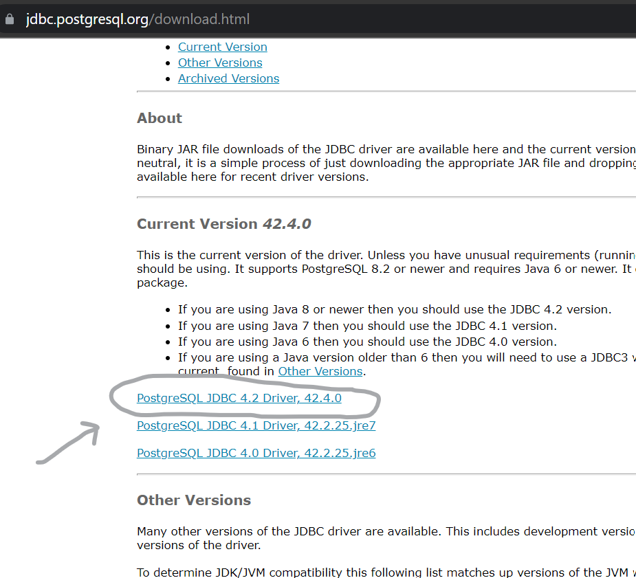
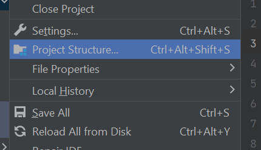
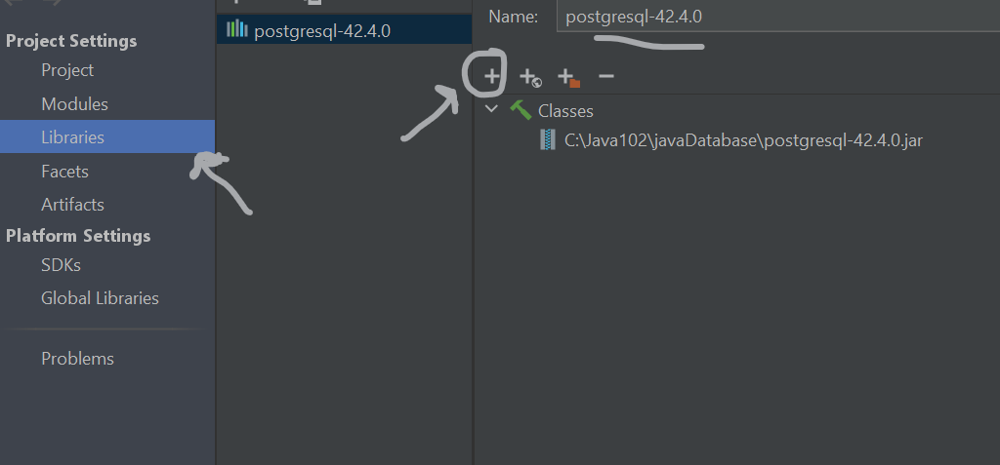
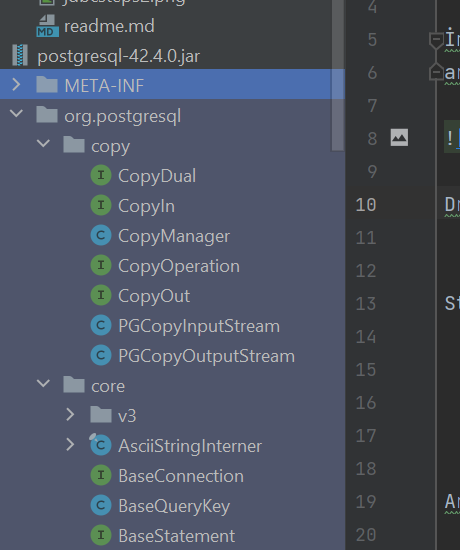
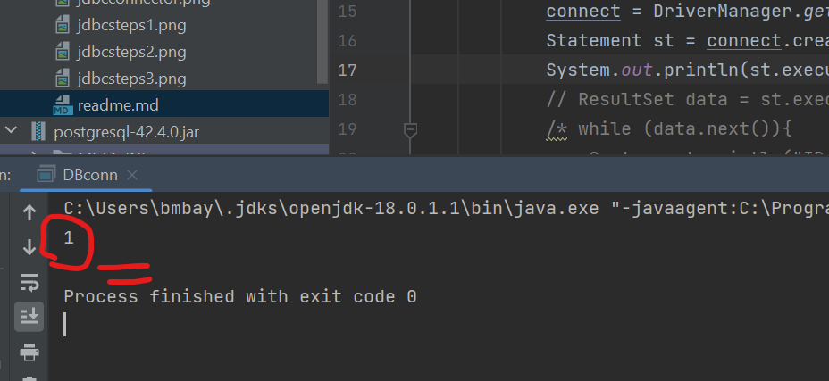

Database işlemleri yapacağımız dosya içerisinde indirdiğimiz postgresql jdbc connector dosyalarımızı atıyoruz 

İndirdiğimiz driverı kütüphanemize eklemek için  File --> Project Structure --> Libraries
ardından + butonuna basıp bilgisayarımızda dosyamızın bulunduğu yeri seçerek driverımızı yüklemiş oluyoruz. 

 

Driverımızı yükledikten sonra görüldüğü gibi kullanacağımız ınterfaceler, sınıflar ve metotlar hazır gelmiş oluyor

Artık işlemlerimizi rahatça yapabiliriz bir sınıf oluşutuyoruz ve Static final değişkenlere Postgresql bilgilerimizi işliyoruz.

         public static final String DB_URL = "jdbc:postgresql://localhost/databaseniz";
         public static final String DB_USER = "Database kullanıcı adınız";
         public static final String DB_PASSWORD = "Database şifreniz";

Ardından main metodumuzun içerisinde bir connection oluşturup null değeri veriyoruz.
            
         Connection connect = null;

ve try-catch ifademiz içerisinde database'imize bağlanmaya çalışıyoruz bir hata var mı bakıyoruz, hata yoksa bağlantı başarılıdır

       try {
            connect = DriverManager.getConnection(DB_URL,DB_USER,DB_PASSWORD);
            
        }catch(SQLException e){
            System.out.println(e.getMessage());
        }

Statement ile bir statement oluştuduk ardından result set ile data değişkeni oluşturu query yapabiliriz.
bir query değişkeni oluşturup adına sql diyelim ve string bir veritipinde sorgu parametleremizi girelim.

            String  sql = "SELECT * FROM actor";
            try {
            connect = DriverManager.getConnection(DB_URL,DB_USER,DB_PASSWORD);
            Statement st = connect.createStatement();
            ResultSet data = st.executeQuery(sql);
                while (data.next()){
                System.out.println("ID : "+data.getInt("actor_id"));
                System.out.println("NAME : "+data.getString("first_name"));
                System.out.println("SURNAME : "+data.getString("last_name"));
                }

            }catch (SQLException e){
            System.out.println(e.getMessage());
            }

Görüldüğü gibi postgresql içerisinde ki bir databasede tablodaki verileri çekip bunları yazdırabiliyoruz.

Peki databasede ki tabloya veri girişi yapmak istersek?
bir insert query oluşturuyoruz
        
    
    String insertsql ="INSERT INTO actor (first_name,last_name) VALUES ('Oguzhan','Kasparov') ";

Excute Update metodu ile hazırladığımız query değişkenini update ediyoruz
    
    st.executeUpdate(insertsql)
    
    
query değişkenimizi terminalde bastırdığımız 1 yazısı çıkıca bu işlemin başarıyla gerçekleştiğini ifade ediyor

    try {
            connect = DriverManager.getConnection(DB_URL,DB_USER,DB_PASSWORD);
            Statement st = connect.createStatement();
            System.out.println(st.executeUpdate(insertsql));
        }catch (SQLException e){
            System.out.println(e.getMessage());
        }
    }

Daha hızlı ve kolay bir yol olan preparedStatement metodunuda kullanabiliriz.
Yeni bir query oluşturalım ve Values kısmına ?,? yazalım bu kısmı diğer metotlar ile doldurucaz

    String presql ="INSERT INTO actor (first_name,last_name) VALUES (?,?) ";

prst adında bir statement değişkeni oluşturup presql querymizi ilgili metot ile connectliyelim.
ardından oluşturulan prst değişkenine value değerlerimizi setliyelim. executeUpadate metodumuz ile updateliyelim.
ve close() metodumuz ile kapatalım. çalıştırdığımız hata almazsak işlemimiz başarılı.
    
     try {
            connect = DriverManager.getConnection(DB_URL,DB_USER,DB_PASSWORD);
            PreparedStatement prst = connect.prepareStatement(presql);
            prst.setString(1,"Tarkan");
            prst.setString(2,"Tarkanov");
            prst.executeUpdate();

            prst.close();
        }catch (SQLException e){
            System.out.println(e.getMessage());
        }
     }

Update işlemi için ise bir yeni bir update query değişkeni oluşturalım;

        String prstSql = "UPDATE actor SET first_name=? WHERE actor_id=?";

try içerisine yeni bir PreparedStatement değişkeni üretip querymizi connectliyelim. Hemen ardından
querymizi setlemek için setString() metodu ile ilk soru işareti için paramet 1 ve değitireceğimiz ismi yazalım
ardından 2. soru işaretimiz için ise setInt() metodumuzun içine parametre 2 ve değişiklik yapacağımız data basedeki satırın id numarasını(actor_id) yazalım.
         
            PreparedStatement pr = connect.prepareStatement(prstSql);
            pr.setInt(2,202);
            pr.setString(1,"Mahmut");
            pr.executeUpdate();

Verimizi silme içinde yine bir query oluşturup bunu preparedStatementta connectliyoruz.

            PreparedStatement pr = connect.prepareStatement(prdltsql);
            pr.setInt(1,202);
            pr.executeUpdate();

İşimiz bittikten sonra tüm işlemleri kapatmak çok doğru bir kullanım olucaktır.

        st.close();
        pr.close();
        connect.close();